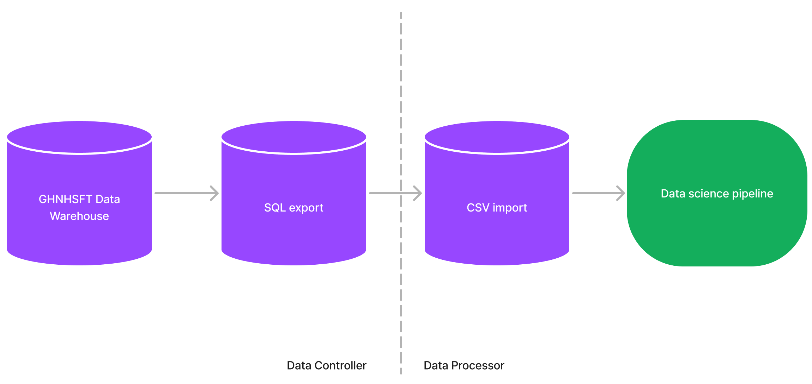

[](LICENSE)


# NHS AI Lab Skunkworks project: Long Stayer risk stratification baseline models

> A internal capability project for the NHS AI (Artificial Intelligence) Lab Skunkworks team, Long Stayer risk stratification baseline models seeks to provide simple baseline models for predicting length of stay (days) in a secondary care setting.

Long Stayer risk stratification baseline models was selected as a project to run in tandem with the [NHS AI Lab Skunkworks project: Long Stayer Risk Stratification](https://github.com/nhsx/skunkworks-long-stayer-risk-stratification) project, and started in March 2022.

## Intended Use

The work contained in this repository is experimental research and is intended to demonstrate the technical validity of applying machine learning models to medical records datasets in order to predict length of stay. It is not intended for deployment in a clinical or non-clinical setting without further development and compliance with the [UK Medical Device Regulations 2002](https://www.legislation.gov.uk/uksi/2002/618/contents/made) where the product qualifies as a medical device.

## Data Protection

This project was subject to a Data Protection Impact Assessment (DPIA) and Data Processing Agreement (DPA), ensuring the protection of the data used in line with the [UK Data Protection Act 2018](https://www.legislation.gov.uk/ukpga/2018/12/contents/enacted) and [UK GDPR](https://ico.org.uk/for-organisations/dp-at-the-end-of-the-transition-period/data-protection-and-the-eu-in-detail/the-uk-gdpr/). No data or trained models are shared in this repository.

## Background

Hospital long stayers, those with a length of stay (LoS) of 21 days or longer, have significantly worse medical and social outcomes than other patients. Long-stayers are often medically optimised (fit for discharge) many days before their actual discharge. Moreover, there are a complex mixture of medical, cultural and socioeconomic factors which contribute to the causes of unnecessary long stays.

The AI Lab Skunkworks team commissioned a [Long Stayer Risk Stratification](https://github.com/nhsx/skunkworks-long-stayer-risk-stratification) model in April 2021 using some approaches from Generative Adversarial Networks (GANs), including a Convolutional Neural Network (CNN) to predict Length of Stay and an associated risk score.

This project aims to complement that work with simpler baseline models that could be replicated at other hospital trusts, and is divided into two phases:

1. Phase 1: Series of Jupyter Notebooks containing baseline model code
2. Phase 2: [Reproducible Analytical Pipeline](https://github.com/NHSDigital/rap-community-of-practice) including data pipelines

Currently, this repository delivers **Phase 1**.

## Overview

This repository contains a series of [notebooks](notebooks/) which implement the data science pipeline for model development:

1. Data loading
2. Exploratory Data Analysis (EDA)
3. Data cleaning
4. Feature engineering
5. Modelling
6. Evaluation

The results of the analysis will shortly be available as a written report, stored in this repository.

## Data pipeline

Anonymised data was exported from Gloucestershire Hospitals NHS Foundation Trusts Data Warehouse:



A data dictionary of fields is available [here](docs/data-dictionary.csv).

## Model selection

Simple baseline models were implemented using commonly available packages including [scikit-learn](https://scikit-learn.org/), [CatBoost](https://catboost.ai) and [XGBoost](https://xgboost.readthedocs.io/en/stable/).

Models were trained using 5-fold crossvalidation, with initial attempts at hyperparameter tuning yielding small (single %) improvements in performance. `GridSearchCV` has been implemented for further hyperparameter tuning attempts.

* A series of **regression** models were developed to predict **Length of Stay (days)**.
* A series of **classification** models were developed to predict a **risk score** of becoming a long-stayer, according to the following mapping:

Risk Category|Day Range for Risk Category
-----|------
1 - Very low risk|0-6
2 - Low risk|7-10
3 - Normal risk|11-13
4 - Elevated risk|14-15
5 - High risk|>15

Models were also compared by calculating an equivalent risk score from the predicted length of stay:

Model|Regression version|Classification version
---|---|---
Dummy|Mean|Prior
Elastic Net|ElasticNet|LogisticRegression
Decision Tree|DecisionTreeRegressor|DecisionTreeClassifier
Random Forest|RandomForestRegressor|RandomForestClassifier
Catboost|CatBoostRegressor|CatBoostClassifier
XGBoost|XGBRegressor|XGBClassifier

## Metric selection

### Regression

* Regression models were trained using `neg_mean_squared_error`.
* Regression models were evaluated using `mean_absolute_error`.

### Classification

* Classification models were trained and evaluated using `f1_weighted`.

## Known limitations

1. The pre-processing stages of the notebooks are tied to the specific extract from Gloucestershire Hospitals NHS Foundation Trust, and will need modifying to work on different datasets. A pipeline version of this project is due for development and sharing in this repository.
2. Data loading functionality is specific to the Azure Machine Learning environment used for this project.
3. Feature engineering is basic, with no external datasets included in the analysis.
4. The exclusion of minor incidents reduced the available data by 70%, and should be reviewed.

## Directory structure

This repository relies on two folders outside of the git tree, to safely store data and model artefacts:

```
project-directory
├── repo-directory
│   ├── .github
│   ├── config
│   ├── docs
│   └── notebooks
├── data
└── models
```

## Getting Started

1. Create a folder for this project, and clone this repository as a subfolder of that folder e.g. `repo-directory` as above
1. Create a new virtual environment e.g. `pyenv virtualenv 3.8.5 long-stay-baseline`
2. Activate your environment e.g. `pyenv activate long-stay-baseline`
3. Install required packages: `pip install -r requirements.txt`
4. **Activate the git pre commit hook: `pre-commit install`**
5. Execute notebooks in [notebooks/](notebooks/)

## NHS AI Lab Skunkworks

The project is supported by the NHS AI Lab Skunkworks, which exists within the NHS AI Lab at the NHS Transformation Directorate to support the health and care community to rapidly progress ideas from the conceptual stage to a proof of concept.

Find out more about the [NHS AI Lab Skunkworks](https://www.nhsx.nhs.uk/ai-lab/ai-lab-programmes/skunkworks/).
Join our [Virtual Hub](https://future.nhs.uk/connect.ti/system/text/register) to hear more about future problem-sourcing event opportunities.
Get in touch with the Skunkworks team at [aiskunkworks@nhsx.nhs.uk](aiskunkworks@nhsx.nhs.uk).

## Licence

Unless stated otherwise, the codebase is released under [the MIT Licence][mit].
This covers both the codebase and any sample code in the documentation.

The documentation is [© Crown copyright][copyright] and available under the terms
of the [Open Government 3.0][ogl] licence.

[mit]: LICENCE
[copyright]: http://www.nationalarchives.gov.uk/information-management/re-using-public-sector-information/uk-government-licensing-framework/crown-copyright/
[ogl]: http://www.nationalarchives.gov.uk/doc/open-government-licence/version/3/
